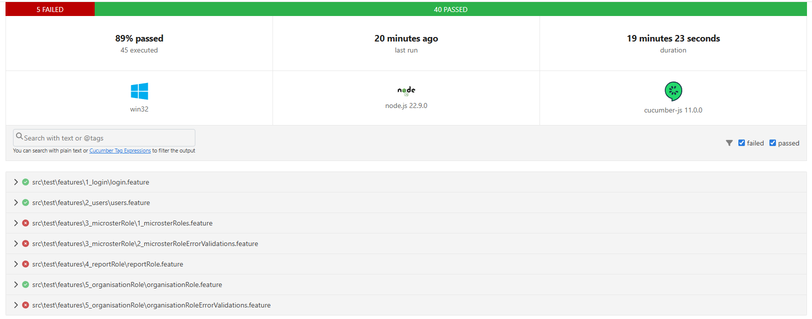
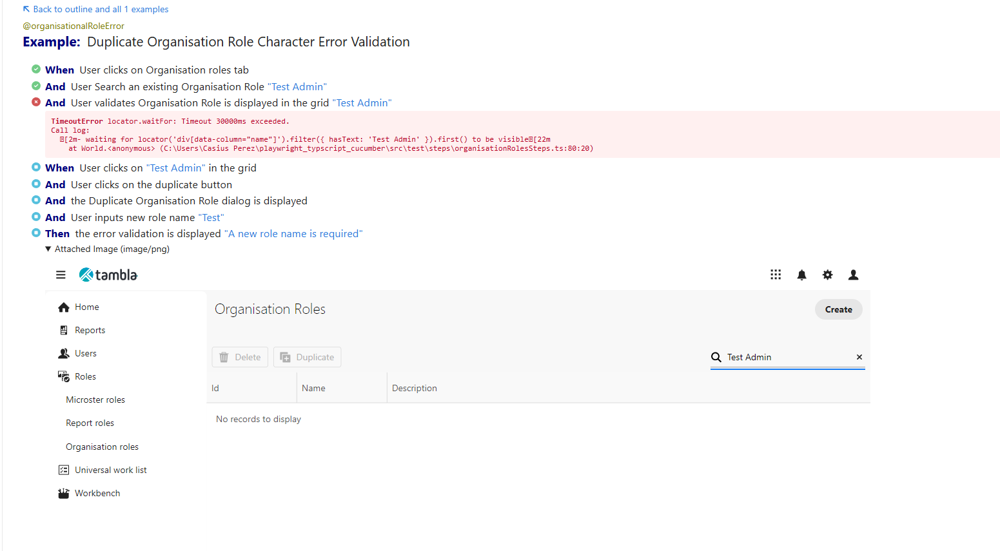

# Playwright (Typescript) + Cucumber (BDD)

Cucumber is a popular behavior-driven development (BDD) tool that allows developers and stakeholders to collaborate on defining and testing application requirements in a human-readable format. 
TypeScript is a powerful superset of JavaScript that adds optional static typing, making it easier to catch errors before runtime. By combining these two tools, we can create more reliable and maintainable tests.

## Get Started

### Setup:

1. Install latest version of [NodeJS](https://nodejs.org/en/download/prebuilt-installer)
2. Clone or download the project from [GitHub Repository](https://github.com/casperez29/talisman)
3. Extract and open in the `VS-Code`
4. `npm i` to install the dependencies
5. `npx playwright install` to install the browsers
6. To execute the whole test suite, run in the command line:
```
npm test
```
7. Use tags to run a `specific feature file`. Run in the command line:
```
npm run feature "@users"
```
8. To run a `specific scenario`, run in the command line:
```
npm run scenario "Create User with Required fields"
```

## Project structure

- src -> Contains all the features & Typescript code
- test-results -> Contains all the reports related file


## Reports

1. `Test Suite Report` location: test-results/reports/`index.html`
2. `Default Cucumber report` location: test-results/`cucumber-report.html`
3. Screenshots of failure

## Sample report


## Extensions (VS-Code Marketplace)
1. Cucumber
2. Cucumber (Gherkin) Full Support
3. ESLint
4. Playwright Test for VSCode
5. Prettier - Code formatter
6. Code Spell Checker
7. BDD Goto Step
8. BDD - Feature-Editor

### Folder structure
0. `src\pages` -> All the page (UI screen)
1. `src\test\features` -> write your features here
2. `src\test\steps` -> Your step definitions goes here
3. `src\hooks\hooks.ts` -> Browser setup and teardown logic
4. `src\hooks\pageFixture.ts` -> Simple way to share the page objects to steps
5. `src\helper\report` -> To generate the report
6. `config/cucumber.js` -> One file to do all the magic
7. `package.json` -> Contains all the dependencies

## Tutorials
1. Learn Playwright - [Playwright - TS](https://youtube.com/playlist?list=PL699Xf-_ilW7EyC6lMuU4jelKemmS6KgD)
2. BDD in detail - [TS binding](https://youtube.com/playlist?list=PL699Xf-_ilW6KgK-S1l9ynOnBGiZl2Bsk)
